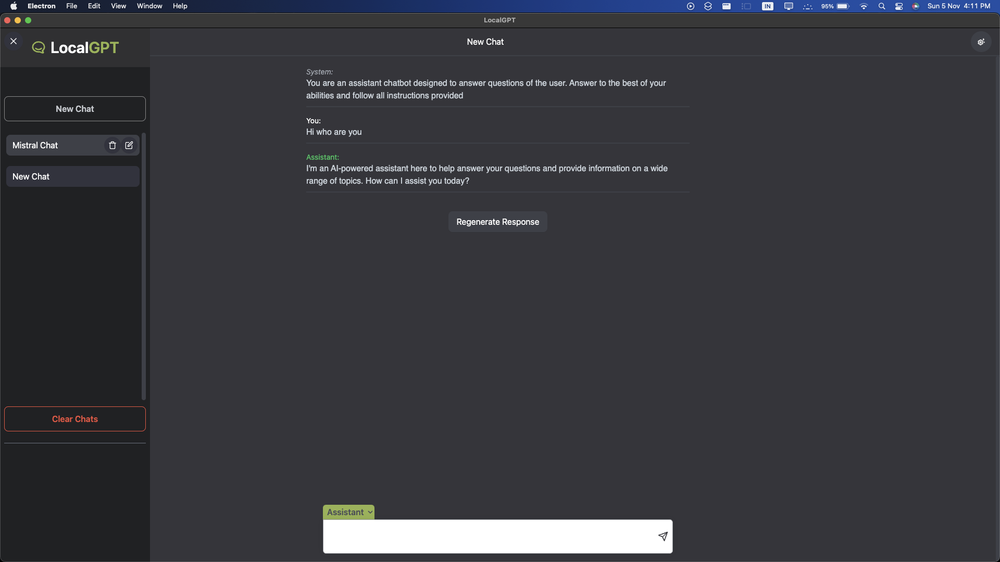
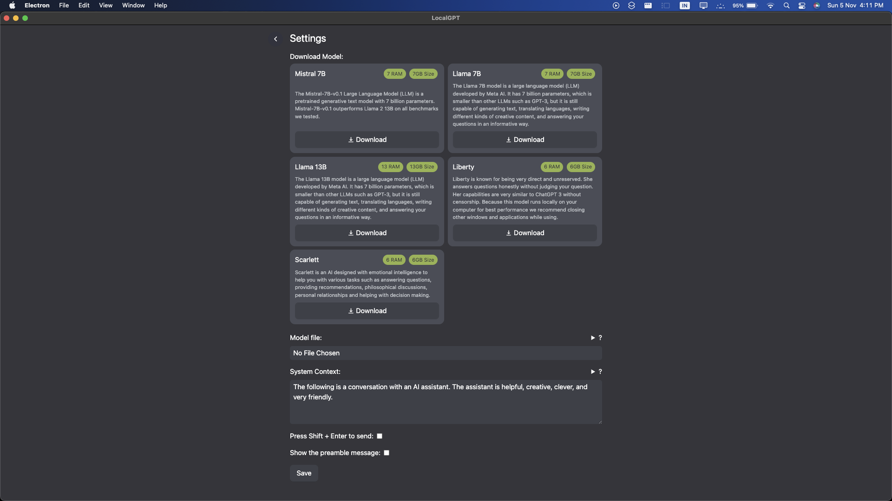

# LocalGPT

A Desktop App to run and use LLMs locally. A step towards democratizing AI.
Current solutions require you to run LLM through terminal. This is a GUI based solution to allow seamless use of GGML based models allowing user to save chats, edit bots and customize experience.

#### To run locally

> git clone https://www.github.com/lakshya-dhariwal/LocalGPT

> cd LocalGPT

> yarn

> yarn dev
